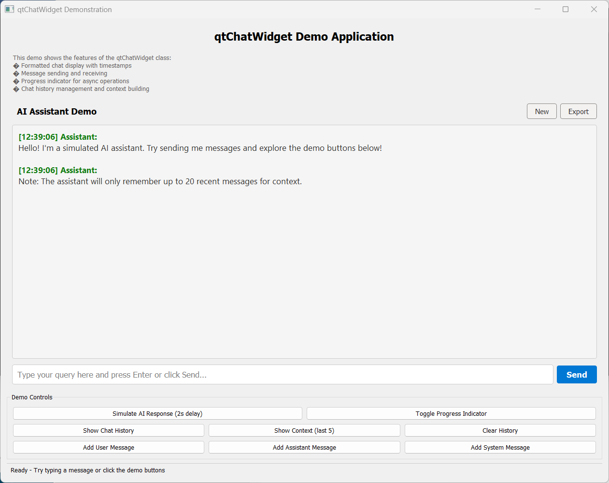

# qtChatWidget

A simple and reusable Qt widget for creating chat interfaces with AI assistant integration.

## Overview

`qtChatWidget` (`uiChatWidget` class) is a fully-featured, ready-to-use chat interface widget built with Qt 5.15+. It provides a polished chat UI with message history, formatted display, progress indicators, and built-in context management suitable for AI/chatbot applications.

## Features

- **📝 Formatted Message Display**
  - Color-coded messages by sender (User, Assistant, System)
  - Timestamps for each message
  - Automatic scrolling to latest message
  - Rich text formatting support

- **⚡ Interactive Input**
  - Text input box with placeholder text
  - Send button with hover effects
  - Enter key support for sending messages
  - Enable/disable controls during processing

- **🔄 Progress Indication**
- Animated progress bar for async operations
  - Show/hide functionality
  - Visual feedback during AI processing

- **💾 Chat History Management**
  - Structured message storage (timestamp, sender, content, role)
  - Export/import chat history
  - Context building for AI APIs (OpenAI format compatible)
  - Configurable context window size

## Requirements

- Qt 5.15+ (Core, GUI, Widgets modules)
- C++14 or later
- Windows, Linux, or macOS

Please see the README.md file in the qtChatWidget directory for detailed instructions on building and integrating the `qtChatWidget` into your Qt applications.

## Demo Application
A demo application is included to showcase the features of the `qtChatWidget`. It demonstrates how to integrate the widget into a Qt application and provides a simple interface for testing chat functionality.
To run the demo application, follow these steps:
1. Clone the repository:
   ```bash
   git clone https://github.com/yourusername/qtChatWidget.git
   cd qtChatWidget

2. Build the demo application:
A Visual Studio solution file (`QtChatWidgetDemo.sln`) is provided for Windows users.
Open the solution in Visual Studio and build the solution.

3. Run the demo application:
   - From the Visual Studio menu, select the QtChatWidgetDemo project and run.
   - or execute the built binary from the terminal.



## Credits

**Created by**: Tian-Qing Ye  (email: tqye2006@gmail.com)
**AI Assistant**: Claude Sonnet 4.5  
**Date**: November 25, 2025  
**Qt Version**: 5.15.2  
**C++ Standard**: C++14

## License

This project is licensed under the MIT License - see the [LICENSE](LICENSE) file for details.
(For Qt, please refer to the Qt licensing terms.)

## See Also

- [qtChatWidget Documentation](qtChatWidget/README.md)
- [Qt Documentation](https://doc.qt.io/)
- [OpenAI API Reference](https://platform.openai.com/docs/)

---

**Version**: 1.0  
**Status**: Demonstration/Educational  
**Platform**: Windows, Linux, macOS
